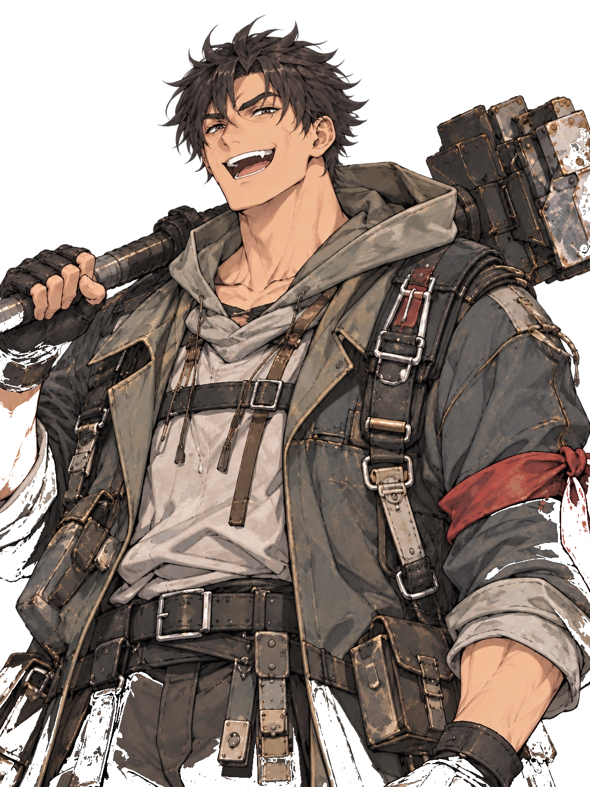
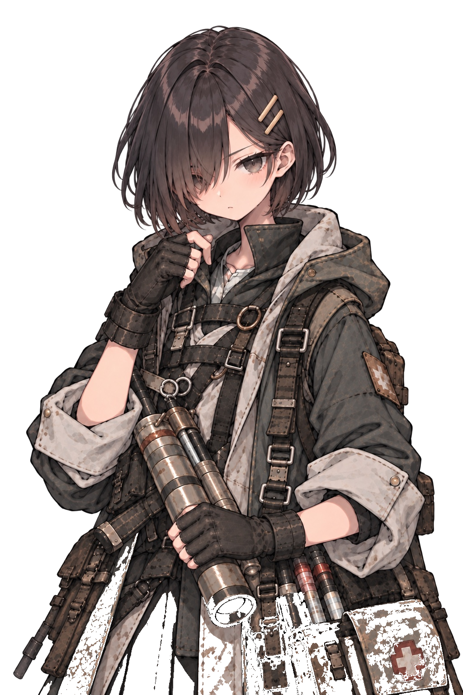
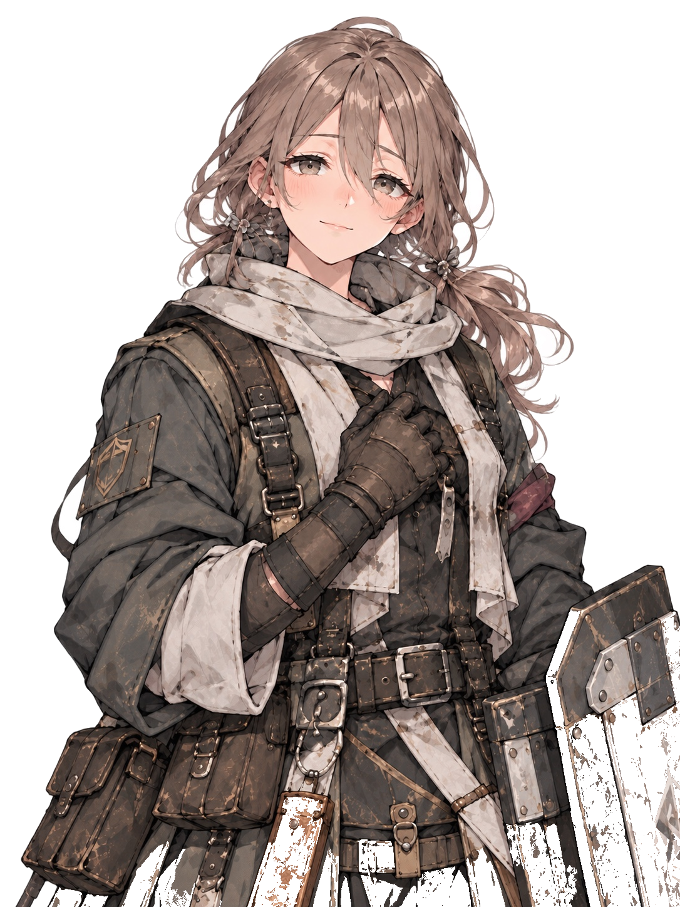
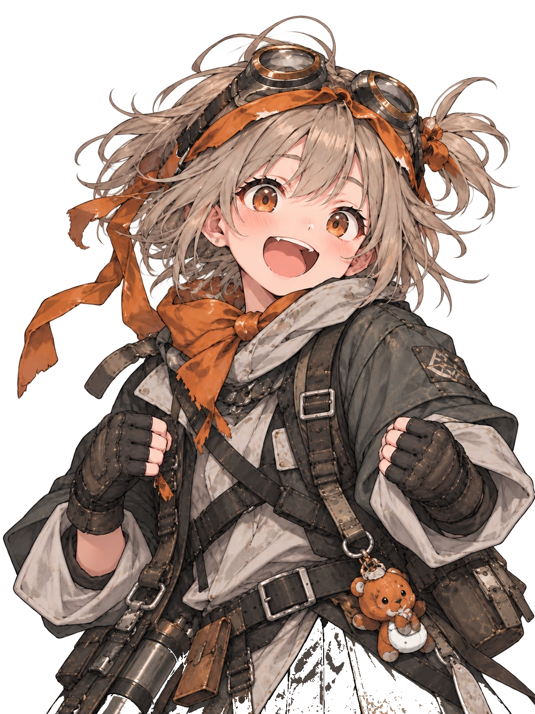
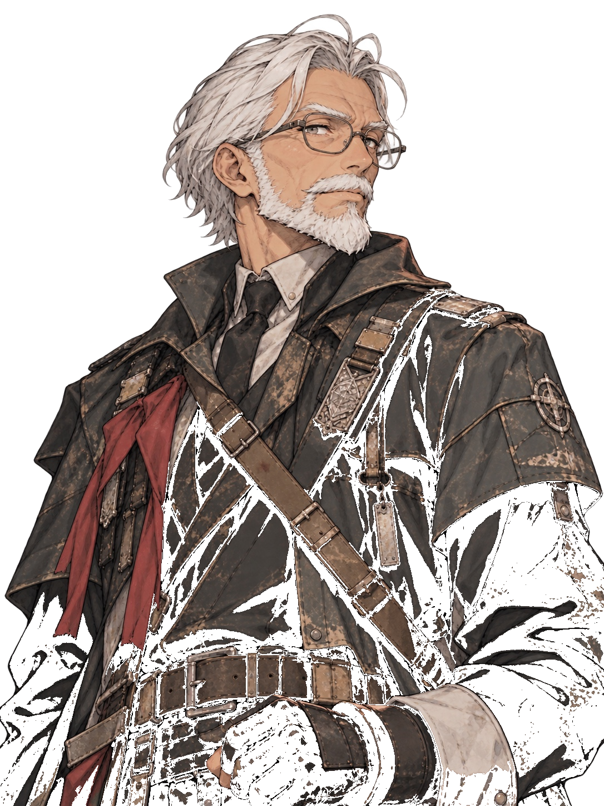

# Bust-up checkpoint v0

本編5人の**会話UI向け暫定バストアップ**です。完成版ではなく、実際のゲーム画面にはめて、顔の距離・余白・左右配置・読みやすさを検証するためのチェックポイントです。

全体の視覚方向は [`../CHARACTER_ART.md`](../CHARACTER_ART.md)、5人集合の基準画像は [`../cast_reference_v1.jpg`](../cast_reference_v1.jpg) を参照します。

| ゴウ | ツグミ | ナギ | ヒバナ | ゲンゾウ |
|---|---|---|---|---|
|  |  |  |  |  |

## 採用メモ

- **ゴウ** — 現状採用。豪快な笑顔、暗い乱れ髪、赤い差し色。ヒゲは付けない。
- **ツグミ** — 今回の重点調整。15歳らしい小柄な体格。服の横への広がりを抑え、相対的に頭を大きくする。額の露出を小さくし、長い前髪が目に掛かって、**顔が髪に埋もれて見える**集合絵の印象を残す。
- **ナギ** — 現状採用。柔らかく、少し困った雰囲気。庇護役でも威圧的な重装タンクにはしない。
- **ヒバナ** — 現状採用。明るく、今にも動きそうな表情と軽快さ。
- **ゲンゾウ** — 現状採用。書記ではなく、静かに盤面を整える古参の参謀／副官。

## 透過版

上の画像は、今回添付されたJPEGの外周に接続する白背景を除去した、会話UI向けの暫定透過PNGです。人物内部の白い服・髪などは保持しています。元のJPEGは比較用に残しています。

| 人物 | ファイル | サイズ | SHA-256 |
|---|---|---:|---|
| ゴウ | [`gou.png`](./gou.png) | 1086×1448 | `3bd58bd42fffcbc277cdc9334168125f95ccd47cb812549e9f7b145c941dce67` |
| ツグミ | [`tsugumi.png`](./tsugumi.png) | 1024×1536 | `672ef0d45abce1a10bd6e7213cc6f3783e0eae049793533deecc49ab275b8fc7` |
| ナギ | [`nagi.png`](./nagi.png) | 1086×1448 | `c2a3a2635b90b4884ad200b76372f189316f5288999bc4f961d55c5b4680613b` |
| ヒバナ | [`hibana.png`](./hibana.png) | 1086×1448 | `552b584ef0952074f350003de0b8162fec673850f3365102e2c081c3d7b0b50c` |
| ゲンゾウ | [`genzou.png`](./genzou.png) | 1086×1448 | `d2e7bb4489ab0b6cfd561776bd35a6f0b85be52f0eb61b7975d3275020054d80` |

## 元生成画像

リポジトリ内のJPEGは参照用の縮小版です。採用元PNGは次の通りです。

| 人物 | 元画像 | SHA-256 |
|---|---:|---|
| ゴウ | 1086×1448 | `207b01a46fe834d5268075fdef05b8eb583c1e541d354c1039ed2377e5d769ca` |
| ツグミ | 1024×1536 | `340d18873bda1c159f6621eb8da4201b6598f384db435698e75a492457c25294` |
| ナギ | 1086×1448 | `c68f80411af04418b13de5bf925636b5c6ca72a3065afed627ae2650ae3a767c` |
| ヒバナ | 1086×1448 | `0610bc7bb0031edc9207d8b6b4fdb9fb2828fc6d904b221a926b309c80b6189e` |
| ゲンゾウ | 1086×1448 | `c191a6aa5308436f053f46266e5d8ad0b61673d727e0e6c50f083a0bd88517f8` |

## 次にやること

この5枚をまずゲームの**実際の会話UIへ仮組み**する。そこで顔の大きさ、上下左右の余白、左右配置、セリフとのバランスを確認し、必要なものだけ微修正する。その後に表情差分へ進む。
