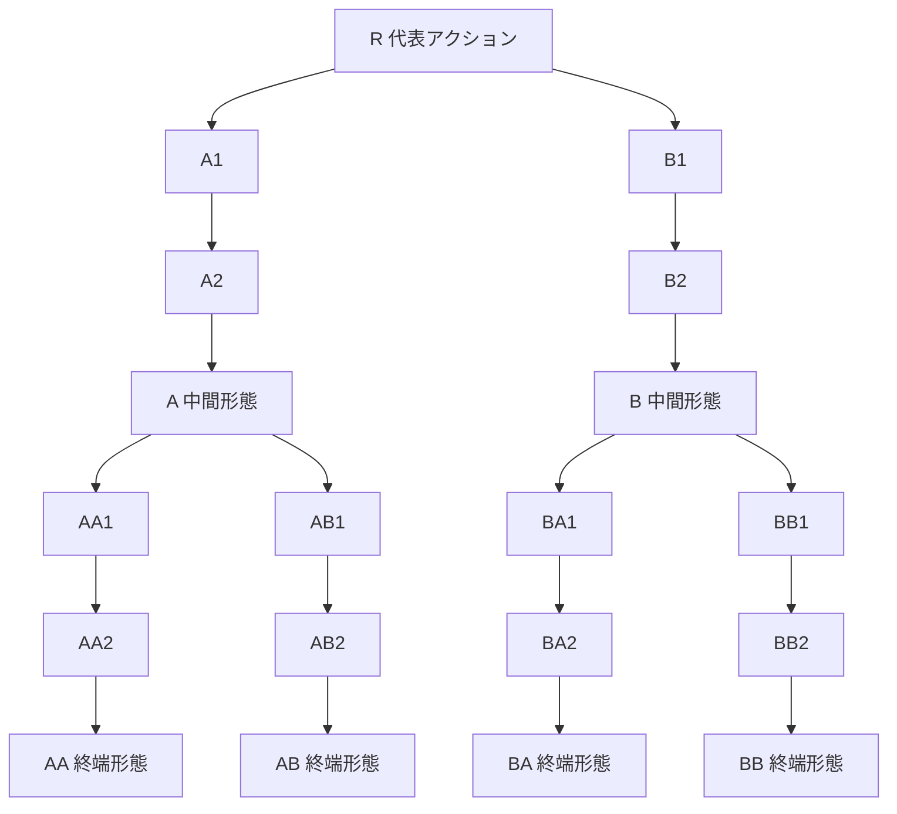

# 武器ツリー再設計 — 主軸一つと、横断する特性

更新日: 2026-09-19
状態: **次の実装候補として採用する設計案。コード・保存形式・数値バランスは未変更。**
関連: PR #285 / PR #286、`11-weapon-catalog.md`

## 1. 発端

現行の技能構造には、次の問題がある。

- 味方アクティブの大半は AP1 で、同じ一つの行動枠を奪い合う。
- 無条件アクティブを輪番にすると、二本目は一本目の代わりに出る。強い一本へ弱い二本目を足すと、
  技能点を払ったのに戦果が落ちる。
- 同じ技能を Lv10 まで上げる投資は出番を減らさないため、新しいアクティブを取る投資より安定して強い。
- 現行mainにはプレイヤー向けの節が active 58 / reactive 55 / passive 29、合計142節ある。
  三種別の巨大な森に分かれており、技能がどの戦い方へ属するかを一覧しにくい。

固定標本では、踏み込み斬り Lv10 に貫き突き Lv1 を足すだけで、10ラウンドの総ダメージが
約72%まで下がった。これはバランスの誤差ではない。取得が不可逆なゲームで、横へ広げるほど
弱くなる構造そのものが問題である。

### 1.1 PR #285が直したものと、残したもの

PR #285は、無条件アクティブのLv後半を高価にし、一本へ全投資する機会費用を増やした。
しかし、二本目が一本目の出番を奪う規則は残る。最適な集中地点をLv10から別の地点へ移すだけで、
複数アクティブを使う面白さにはならない。

同PRで見つかった次の成果は、再設計後も残す価値がある。

- `redirect_pending_target` が reach を越える不具合の修正。
- 「仕込む役」と「状態を食う役」を分けると、人物の能力差と隊全体の掛け算が生まれるという実測。
- 対象決定は発動条件とは別の軸であり、全アクティブへ横断的に作用するという整理。

### 1.2 PR #286が直したものと、残したもの

PR #286は味方の行動を「条件／主軸／予備」に分け、二本目の無条件行動が主軸の出番を奪わないようにした。
これは事故防止として正しい。一方で、主軸が対象とAPを満たす限り予備は出ないため、
多数の無条件アクティブを取得する理由は生まれない。

残す考え方は、**条件が成立したときだけ主軸と違う結果を出す**ことである。ただし再設計では、
条件付きの別アクティブを優先列へ増やすのではなく、原則として**一つの主軸を条件付き特性が変形する**。

## 2. 採用する中心命題

> 一人物が一拍に選ぶ主軸は一つでよい。構築の広がりは、主軸の本数ではなく、
> 主軸・対象・被弾・移動・状態・資源へ横断的に作用する特性から作る。

この命題から、次を採用する。

1. 技能ツリーを「アクティブ／リアクティブ／パッシブ」ではなく、戦槌・長銃・長槍・大盾などの
   **武器種**で分ける。盾、医杖、号旗のような防御・治療・指揮の遺装も武器に含める。
2. 各武器は一つの `actionFamily` を持つ。ルートで代表アクションを取得し、深い形態は同じ経路の
   旧形態を置き換える。別経路の形態はsidegradeであり、取得後に選び直せる。
3. 一人物が選択するメインアクションは常に一つ。AP2なら選択処理を二回行い、同じ主軸を二回使える。
   一回目で盤面が変われば、二回目に乗る条件付き特性は変わり得る。
4. 技能レベルを廃止する。連続した+12%を十回買う代わりに、有限個の節で用途・対象・条件・接続を変える。
5. リアクティブとパッシブは、プレイヤー向けには**特性**としてまとめる。RPを払う反応、無料の条件強化、
   能力補正、戦闘開始時効果の違いは、種別タブではなく各節の条件・費用・上限として表示する。
6. 取得した特性は原則として即時オンになる。取得済み／オン／一時オフの三状態を維持し、
   「取得済みだが未装着」という第四状態は作らない。
7. メインアクション、照準、姿勢など互いに競合する規則だけを排他グループにする。
8. 一遠征で有効な武器は最大10種。新しい武器を導入するときは、遠征開始前に外れる武器を確定し、
   技能点を払った後で利用不能にしない。

## 3. 武器ツリーの共通形

一武器の標準形は19節とする。

`R + 2×3 + 4×3 = 19`である。位置の意味を次に固定する。

| 位置 | 標準の役割 |
|---|---|
| R | 武器への入口。1SPで代表アクションを取得する |
| A1〜A2 / B1〜B2 | 戦い方の方向を作る特性、照準、姿勢、他武器への橋 |
| A3 / B3 | 代表アクションを二方向へ分ける中間形態 |
| AA1〜AA2等 | その方向を別の共有event・条件へ接続する特性 |
| AA3等 | 中間形態を質的に伸ばす終端形態。兄弟終端とはsidegrade |

19節は画面と設計の共通文法であり、数合わせの義務ではない。意味のない節を埋めるくらいなら、
15〜18節で止め、空き位置を明示した方がよい。`11-weapon-catalog.md`では比較のため全10武器を
19節ずつ書くが、実装候補へ落とすときに統廃合してよい。

## 4. アクション形態は「別の装着技能」にしない

同じ経路の形態は完全上位互換でよい。ただし、旧形態を装着欄へ残さない。

例:

`槌打ち R → 崩城打ち A3 → 震天崩し AA3`

- `崩城打ち`を取ると、戦槌のA経路では`槌打ち`の代わりに使える。
- `震天崩し`を取ると、A→AA経路では`崩城打ち`を置き換える。
- A→ABの終端も取得していれば、AAとABは戦闘前に選択できる。兄弟は単体／範囲、初動／継続、
  安定／高天井などの交換を持ち、完全上位互換にしない。
- 同じ武器の形態を複数取得しても、メインアクション欄に出るのは現在選択中の一つだけである。

これにより、技能レベルの「深く伸ばす」感触を残しながら、Lv1〜Lv10の同じ倍率を並べない。

## 5. メインアクションとAP

### 5.1 一人物につき一つ

メインアクションはラジオ選択にする。新しい武器のルートを取得しても、既存のメインを黙って切り替えない。

- まだメインが無い人物が最初のルートを取った場合だけ、その武器を自動選択する。
- 現在のメイン武器で新しい形態を取った場合は、その経路の新形態へ更新する。
- 別武器のルートや形態を取った場合は候補へ加えるが、現在のメインは維持する。

### 5.2 APは「上から何本使うか」ではない

APは、その人物が一ラウンドに何回起動できるかを表す。起動のたびに、次を同じ順で評価する。

1. 選択中の姿勢と照準を読む。
2. メインアクションの対象候補を作る。
3. 現在の盤面で成立する条件付き特性を適用する。
4. APと追加費用を払い、メインアクションを解決する。
5. 発生したeventへ、RP費用とlimitを持つ特性が反応する。

APを味方から受け取って三回目に動いても、「装着欄の三番目」が突然出ることはない。
同じ主軸を再評価し、盤面が変わった分だけ結果が変わる。

### 5.3 支援主軸の戦闘進行

大盾・医杖・号旗のように、主効果が攻撃でない武器も認める。敵を残して時間だけを稼ぐ行動にしないため、
現行と同じく、純支援アクションの解決後には弱い通常追撃を付けることを基準案とする。
準備、明示された有限回数、HPや装備耐久の支払いなど、別のanti-stall根拠がある形態は個別に例外を検討する。

## 6. 特性の統合

### 6.1 プレイヤー向けの分類

技能画面で、リアクティブとパッシブを別の森にしない。各武器の木の中で次を同じ「特性」として並べる。

- 常時能力を変える。
- 条件を満たす間だけ主軸の量や対象数を変える。
- `damage_taken`や`actor_moved`などのeventへ、RPなし・limit付きで小さく反応する。
- RPを払い、大きい割り込みや対象変更を行う。
- 戦闘開始時、ラウンド開始時、戦闘後などの境界で一度だけ働く。

内部実装で静的補正・event rule・対象問い合わせを分けることは妨げない。統合するのは、
プレイヤーが「どの武器の戦い方を伸ばすか」を読む単位である。

### 6.2 横断特性

特性の多くは、その武器をメインにしていなくても働く。横断は固有技能IDではなく、共有された事実を読む。

- 戦槌: 怯み、guard減少、防壁破壊。
- 大剣: 低HP、自傷、過剰ダメージ、撃破。
- 長銃: 対象選択、後列、同一対象、準備。
- 医杖: 実効回復、回復窓、守勢、状態除去。
- 長槍: 列、届き方、先手、標的変更。
- 大盾: 狙われた、庇った、受け止めた、防壁が壊れた。
- 双刃: hit数、対象変更、裂傷、同一chain。
- 鉤鎖: 自他の移動、前後列、位置交換、引き寄せ。
- 号旗: AP/RP移譲、未行動、準備進行、ラウンド境界。
- 重弩: 準備、単発大ダメージ、貫通、過剰ダメージ。

「長銃技能を使ったときだけ戦槌技能が鳴る」のような閉じた固有ペアは作らない。

### 6.3 浅い万能加算を避ける

横断可能であることと、全構成へ無条件で強いことは別である。入口付近へ「全ダメージ+20%」を置くと、
十武器の浅い節を取る構成が常に最善になる。

横断特性は、状態・位置・対象・履歴・残存資源の少なくとも一つを条件にする。強い量を出すものは、
二つ以上の条件、RP、戦闘／ラウンドlimit、HP・耐久などの代償、または深い前提を持つ。

## 7. 排他グループ

取得した特性は原則すべてオンでよいが、同時に一つしか意味を持てない規則は明示的に排他にする。

| グループ | 例 | 取得時の扱い |
|---|---|---|
| メインアクション | 戦槌／長銃／大盾 | 候補へ追加。現在選択中の主軸は勝手に替えない |
| 照準 | 瀕死優先／回復役優先／隙の多い敵優先 | 一つだけ選択。新規取得は候補へ追加 |
| 姿勢 | 前へ出る／後ろで構える／味方を庇う | 一つだけ選択。姿勢なしも許可 |

同じ対象に複数の単純修飾を足す特性は排他にしない。たとえば「裂傷相手へ追加量」と
「RPを残している間だけ追加量」は同時に成立してよい。

## 8. ルート1SPを採る

ルートは無料にしない。武器へ入るには、人物ごとに1SPを払う。

### 8.1 通行料であることを認める

別武器の横断特性だけが欲しい場合でも、代表アクションを取得する1SPが必要になる。
これは偶然の前提税ではなく、次の目的を持つ明示的な参入費である。

- 常に最大10個のメイン候補を並べず、実際に触れた武器だけを人物の候補へ出す。
- 全武器の浅い特性を無差別につまみ食いする構成へ、小さいが確実な機会費用を置く。
- 「この人物の主な武器」と「別武器から借りた規則」の差を残す。
- ルート取得の瞬間に、新しい主軸も試せる現在価値を返す。

ルートへ意味の薄い能力補正を抱き合わせて、通行料でないふりはしない。1SPはアクセス費である。

### 8.2 SPの桁は後で決める

現行候補の13〜15SPでは1SPの比率が大きい。総獲得SPと各節の要求SPを大きい整数へ広げ、
ルートだけ1SP、通常特性2SP、終端3SPのようにすれば、入口を相対的に安くできる。

ただし、現時点では次を決めない。

- 一遠征の総SP。
- 通常戦／boss／開始時の配布量。
- 通常特性と終端形態の標準価格。
- 人物の署名武器に無料ルートを与えるか。

最初の紙上比較では、少なくとも次の二案を並べる。

| 案 | 入口の重さ | 長所 | 懸念 |
|---|---|---|---|
| 現行桁 | 総量13〜15、ルート1 | 数が小さく読みやすい。主武器が立ちやすい | 二本目以降へ入りにくい |
| 拡張桁 | 総量を増やし、ルート1・通常節2以上 | 入口だけ相対的に安くできる | 表示桁と価格設計が増える |

## 9. 人物と武器の関係

五人は二武器ずつを伴って登場する。ただし、解禁後の武器ツリーは全員が利用できる。

| 導入人物 | 武器1 | 武器2 | 初期の読み方 |
|---|---|---|---|
| ゴウ | 戦槌 | 大剣 | 腕力、受け崩し、低HPと大振り |
| ツグミ | 長銃 | 医杖 | 技術、後列、対象選択、治療 |
| ナギ | 長槍 | 大盾 | 間合い、列、庇護、受け止め |
| ヒバナ | 双刃 | 鉤鎖 | 多段、移動、複数行動、隊列操作 |
| ゲンゾウ | 号旗 | 重弩 | 手番・反応の配分、準備、大きな一撃 |

人物専用にしない理由は、古い人物へ新しい武器の規則を渡し、新武器で旧武器の評価を変えるためである。
人物らしさは能力値、AP/RP、初期位置、最初に取得している武器・特性から出す。

ルートを誰が無料で持つかは未決定である。少なくとも、物語上の所有者だけがその武器を使える制限は置かない。

## 10. シナリオと武器manifest

- 第1シナリオではゴウとツグミの四武器を導入する。
- 第2シナリオでナギの二武器、第3でヒバナ、第4でゲンゾウを加え、最大10武器になる。
- 以後に新しい二武器を導入するときは、利用可能な武器を10種以内へ入れ替える。
- 利用可能な武器は遠征開始時から全戦分を開示する。遠征中に突然外さない。
- Campaignでは固定manifest、Free / Endlessでは解禁済みpoolからの選択または抽選を候補とする。

「人物が持ってきた二武器」を必ず残すとは限らない。ただし、manifestから外すことで人物の初期主軸が
無効になる場合は、遠征開始時に別の主軸を選べる状態を保証する。

## 11. 一武器を設計するときの契約

各武器は、最低限次を記録する。

1. 代表アクションが一文で説明できる。
2. A/Bの中間形態が、異なる性能軸を持つ。
3. 四つの終端形態が、少なくとも二つ以上の軸で交換になる。
4. 12個前後の非アクション節の過半が、別武器をメインにしても働く。
5. 横断特性は共有event・状態・位置・資源を読み、固有技能IDを要求しない。
6. 一武器の中に発生源・変換器・利得先・制動／代償を含むが、その武器だけで唯一の完成レシピにしない。
7. 照準・姿勢を置く場合は排他グループを宣言する。
8. RP0の追加効果はAP/RPを生成せず、chain/round/battleの有限性を持つ。
9. 深い形態は、倍率だけでなく対象、届き方、準備、状態、代償のいずれかを変える。
10. ルート1SPを払った時点で、子を取らなくても試す価値がある。

## 12. 今回決めないこと

この文書と`11-weapon-catalog.md`は、発想を広げるための設計資料である。次は未検証・未決定とする。

- 係数、固定値、状態上限、持続時間。
- 13〜15SPを維持するか、SPの桁を広げるか。
- 19節をすべて実装するか、統廃合するか。
- 新しいpredicate / effect / event / target relationの実装可能性。
- 既存142節と保存データをどう移行するか。
- 既存装備・必殺技・敵技能をどの武器へ対応させるか。
- UIの最終レイアウトとチュートリアル。
- 難度曲線と敵数値。

これらを先に理由にして発想を縮めない。カタログを読み、組みたい構成が複数見えるかを先に判断する。

## 13. 実装へ進む前の確認

1. 十武器から、異なる人物・異なる主軸で成立する構成を最低12個、紙上で作る。
2. 各構成から一節を別武器の同役割へ交換し、固有IDの鍵になっていないことを確かめる。
3. メイン武器を最大まで進める構成と、三〜四武器へ入る構成を同じ仮予算で比較する。
4. 照準・姿勢の競合表を作り、順序依存ではなく排他選択で説明できることを確かめる。
5. 追加AP、RP反応、無料反応、準備、移動を含む代表traceを手で書き、循環の入口を洗う。
6. 一武器だけをprototypeし、主軸選択・形態置換・特性統合のUIがiPhoneで読めるか確認する。
7. その後にのみ、SP価格、係数、敵難度、保存移行を決める。
