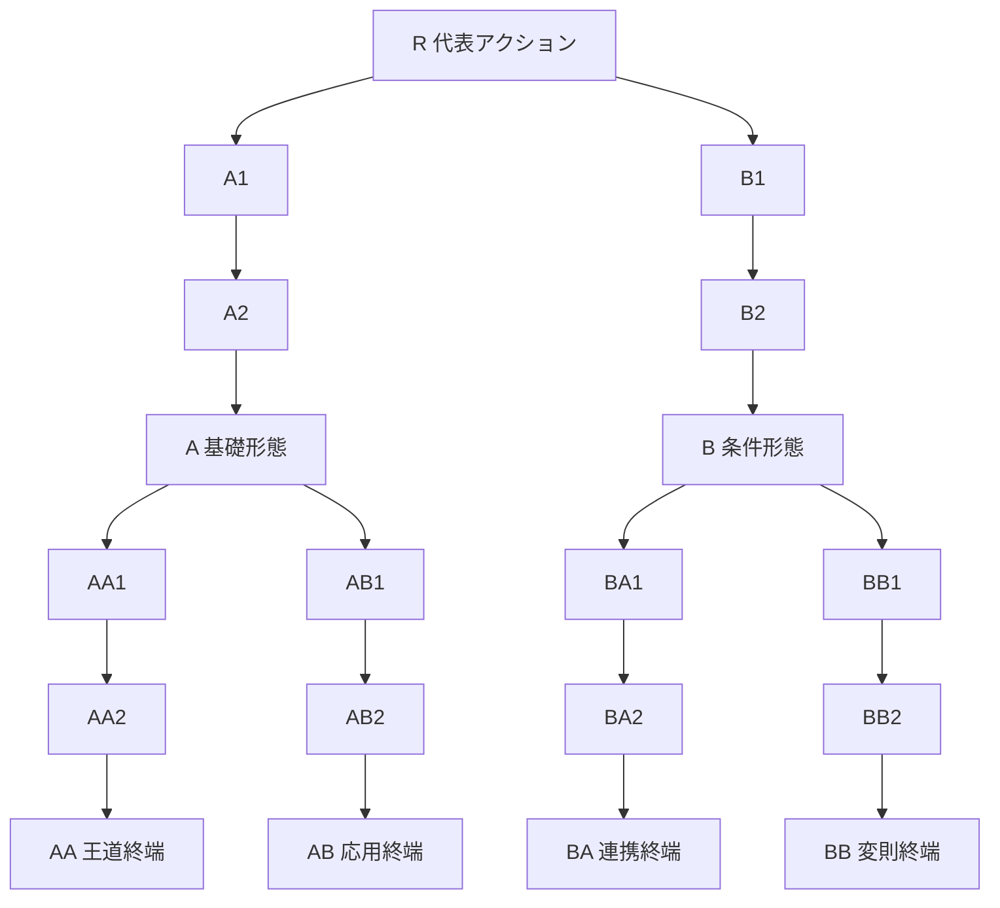

# 武器ツリー再設計 — 一つの主軸、二つの優先列、積み重なるパッシブ

更新日: 2026-09-22
状態: **PR #288でロードアウト基盤・manifest・敵技能分離まで実装済み。個別係数・プレイ感・画面レイアウトは未検証。**
関連: PR #285 / PR #286、`11-weapon-catalog.md`

## 1. 発端

現行の技能構造には、次の問題がある。

- 味方アクティブの大半はAP1で、同じ一つの行動枠を奪い合う。
- 無条件アクティブを輪番にすると、二本目は一本目の代わりに出る。強い一本へ弱い二本目を足すと、
  技能点を払ったのに戦果が落ちる。
- 同じ技能をLv10まで上げる投資は出番を減らさないため、新しいアクティブを取る投資より安定して強い。
- 現行mainにはプレイヤー向けの節がactive 58 / reactive 55 / passive 29、合計142節ある。
  三つの巨大な森に分かれており、技能がどの戦い方へ属するかを一覧しにくい。

固定標本では、踏み込み斬りLv10に貫き突きLv1を足すだけで、10ラウンドの総ダメージが約72%まで
下がった。これは価格の誤差ではない。取得が不可逆なゲームで、横へ広げるほど弱くなる構造そのものが
問題である。

### 1.1 PR #285とPR #286から残すもの

PR #285の価格調整は集中投資の地点を動かすが、二本目が一本目の出番を奪う規則を変えない。
PR #286の「条件／主軸／予備」は事故を止めるが、主軸が使える間、予備を取る理由を作らない。

再設計へ残すのは次の三点である。

- 一人物が一拍に選ぶ主軸は一つでよい。
- 条件は、別の無条件アクティブを順番待ちさせるためでなく、主軸・対象・反応を変えるために使う。
- 対象決定は発動条件と別の軸であり、複数の行動へ横断して作用できる。

## 2. 採用する中心命題

> 構築の広がりは主軸の本数ではなく、一つの主軸、反応と対象を決める二つの優先列、
> そのすべてへ積み重なるパッシブから作る。

この命題から、次を採用する。

1. 技能ツリーはアクティブ／リアクティブ／ターゲット／パッシブで分けず、戦槌・射出器・大盾などの武器別にする。
2. 各節には実行方式として**アクティブ／リアクティブ／ターゲット／パッシブ**の種別を表示する。
3. 一人物が選択するメインアクションは常に一つ。AP2なら同じ主軸を、盤面更新後に二度目も評価する。
4. 技能レベルを廃止する。深いアクティブ形態は同じ経路の旧形態を置き換える。
5. パッシブは該当したものをすべて適用する。早期returnせず、タイミングを消費しない。
6. リアクティブは優先列を上から検査し、最初に成立した一つだけ発動してreturnする。
7. ターゲットは専用の優先列を上から検査し、最初に有効候補を返した一つだけを使う。
8. 姿勢という独立種別と排他装着欄は作らない。姿勢らしい効果も、挙動に応じてパッシブかリアクティブにする。
9. 一遠征で有効な武器は最大10種。新しい武器との入替は遠征開始前に確定する。
10. プレイヤー技能、敵技能、装備pack、武器技能packを別の正本として管理し、旧技能レベルと旧共通技能ツリーを残さない。

### 2.1 実装で固定した境界

PR #288でこの設計をコードへ落とした結果、技能の正本と遠征中の状態を次のように分ける。

- プレイヤー技能の正本は、10武器それぞれの19節からなる武器ツリーregistryだけにする。旧共通技能ツリー、旧root-slices、技能レベル表、旧Free／Endlessのランダムpack経路は持たない。
- 敵AIはプレイヤーの武器技能を参照しない。敵のactive／reactive／passiveを敵専用registryへ置き、敵actorが実際に参照する定義だけを残す。敵技能はプレイヤーのツリーや初期ロードアウトへ混入させない。
- 装備packと武器技能packは別registry・別ID・別manifest欄にする。画面で一つの「pack」カードにまとめるaliasは許すが、装備のaffix poolと技能ツリーを同じ解禁集合として扱わない。
- 10武器のツリー定義は常にcontentへ載せ、遠征ごとのmanifestはそのうち利用できる武器だけを固定する。manifestの解禁順でツリー定義自体を欠落させない。
- 旧saveを移行して読み続けることはしない。現行のprofile／run／manifest／content versionが一致する保存だけを読み、旧形式は明示的に不一致として扱う。旧IDを別の意味へ再利用もしない。
- 個別効果も実装へ同期する。医療具の標準activeは防壁中心とし、A→AA／A→ABのHP回復は被弾リアクティブに限定する。B→BBだけは取得済みの変換節がある場合に限り、防壁をHP回復へ変換できる。これは無条件のactive回復を戻すものではない。再生薬は防壁の再生成、蘇生は汎用`revive`と`actor_revived`で扱う。

これは「実装を先に固定して設計を狭める」という意味ではない。面白さ・最終係数・SP総量は未検証のまま残し、registryの境界、決定論、有限性、予測と本番の同一性だけを実装契約として固定する。

## 3. 四つの実行方式

四分類はツリーの置き場所ではなく、**同時に成立した技能をどう解決するか**を表す。

| 種別 | いつ読むか | 同時に成立したとき | 例 |
|---|---|---|---|
| アクティブ | 自分のAP起動時 | 選択中の主軸一つ | 槌打ち、治療、号令 |
| リアクティブ | 明示されたeventの反応窓 | 優先列の最初の一つだけ | 被弾前に庇う、撃破時にAPを渡す |
| ターゲット | アクティブが対象を問い合わせた時 | 優先列で最初に有効候補を返した一つだけ | 回復役優先、裂傷最大優先 |
| パッシブ | 常時または計算時 | 条件を満たすものをすべて適用 | 与ダメージ+20%、裂傷相手へ+1hit |

### 3.1 アクティブ

- 一人物につきメインアクションを一つ選ぶ。
- 別武器のルートを取っても、現在のメインを勝手に切り替えない。
- 同じ経路の深い形態は親形態を置き換える。旧形態を別スロットへ残さない。
- 兄弟終端を両方取った場合は、遠征準備でどちらを主軸にするか選べる。

### 3.2 パッシブ

パッシブは条件付きでもよい。「常時発動」ではなく、**反応枠を消費せず計算へ参加する**ことが定義である。

- 取得したパッシブは原則すべて有効で、装着枠や排他枠を持たない。
- `与ダメージ+20%`と`裂傷中の敵へ+1hit`が両方成立すれば、両方を適用する。
- HP半分以下、前ラウンドに移動した、対象に状態がある、といった条件を持てる。
- 能力の上げ下げ、対象数変更、状態の増減、直接回復、資源上限変更も扱える。
- 通常パッシブの評価中にreturnしない。上の単純な効果が下の条件効果を奪ってはならない。

非アクティブ節は、原則として出身武器のIDや特定のアクティブIDを発動条件にしない。`戦槌アクティブなら`ではなく、
`攻撃の最初のhit`、`基礎1hitの近接攻撃`、`防壁を付与する主軸`、`準備を経た攻撃`のように、他武器も
満たせる行動特性で書く。これにより、戦槌から借りた怯みを双刃へ、医療具から借りた応急手当・防壁を別の支援主軸へ、
鉤縄から借りた壁打ちを別の強制移動へ接続できる。

武器IDで制限してよいのは、その武器の主軸を置換するアクティブ形態だけである。固有資源も出身武器でなく
本文のeventを発生源・消費先にする。別武器の規則を借りる1SPと経路上のSPが、横断利用の機会費用になる。

### 3.3 リアクティブ

リアクティブは明示されたeventに対する**選択肢の競合**である。

1. eventが反応窓を開く。
2. 反応する人物ごとに、取得済み技能から作ったリアクティブ優先列を上から検査する。
3. 条件、RP、回数制限、技能ごとの**RP留保**を初めて満たした一つを解決する。
4. その人物の反応窓は閉じ、下の技能は検査しない。
5. 他の人物は固定の人物順で、自分の反応窓を同様に解決する。

したがって同じ人物の`被弾前に庇う`と`被弾前に反撃する`は両方起きない。どちらを上へ置くかが構築になる。
別のevent、たとえば`target_selected`と`damage_resolved`にはそれぞれ一度反応できる。

RPを払うかどうかは種別の定義ではない。RP0でも反応窓を一つ使うならリアクティブであり、RP1でも
常時有効な維持費として払うだけならパッシブになり得る。

優先順位だけでは、早いeventの小反応がRPを使い、後で起きる蘇生や完全防御を発動不能にする。各リアクティブは
`発動後に残すRP`を0から基礎RPまで設定できる。たとえば通常追撃を`2`、緊急蘇生を`0`にすれば、追撃はRP2を
残せる時だけ発動し、蘇生は最後のRPまで使える。現在RPを`p`、費用を`c`、留保を`r`とすると
`p >= c`かつ`p - c >= r`の時だけ成立する。初期値は0とし、技能本文の固定条件にはしない。

### 3.4 ターゲット

ターゲットは対象選択だけを担う独立種別である。`[照準]`のような注釈つきパッシブにはしない。

1. アクティブが示す有効対象だけを候補にする。
2. 人物ごとのターゲット優先列を上から検査する。
3. 条件を満たし、有効候補を一体以上返した最初の一つを使う。
4. 候補を返せない規則は不発扱いにせず、次のターゲットへ進む。
5. どれも候補を返さなければ、アクティブ固有の軟優先、最後に既定対象へ進む。

ターゲットは反応窓やRPを消費せず、複数を同時適用もしない。たとえば`回復役優先`と`HP25%以下優先`を
この順に並べれば、回復役がいない時だけ瀕死を狙う。通常のパッシブがこの列へ入り込むことはない。

### 3.5 姿勢を廃止する

「腰を落とす」「背水」「迎撃姿勢」を一律の排他グループにはしない。

- 移動していない間に受け+2: 条件付きパッシブ。別の防御パッシブと重なる。
- 攻撃を受ける直前に前へ出る: リアクティブ。ほかの被弾前反応と競合する。
- 主軸を変える構え: その武器のアクティブ形態。

同条件の効果を意図的に競合させたい場合はリアクティブにする。複数重なってよいならパッシブにする。
「姿勢だから排他」という例外規則は不要である。

### 3.6 応急手当型の副接続

「主軸を強くする節」だけでは、どの武器もR→A→AAを伸ばす一本道になる。そこで各武器に、医療具の「応急手当」と同じく、**主軸とは別の出来事を読んで武器の性格に近い価値へ変える副接続節**を置く。

副接続の数は武器ごとに揃えない。医療具のように回復反応を複数持つ武器もあれば、重弩のように準備の弱点を読む反応を一つに絞る武器もある。大切なのは、取得後にその武器のルートで何が変わったかを説明できることである。

- 選択中の主軸を条件にしない。別武器の主軸を使っていても、被弾・対象指定・準備開始・移動・撃破などのeventで発動できる。
- 主軸の倍率を上げるだけにしない。反撃、回復、被害分散、退避、状態付与、行動権、対象変更のいずれかへ結果を変える。
- 発動条件、RP費用、チェイン／ラウンド／戦闘上限、空きマス、対象生存などを明記する。不成立時にRPだけを失わせない。
- 同じ`damage_taken`でも出口を武器ごとに変える。戦槌は怯み付き反撃、射出器は援護照準、医療具は単体／全体回復、大盾は被害分散、双刃は裂傷付き反撃とする。

リアクティブの同時発動数は、同じ人物については優先列の最初の一つに限る。別人物の反応や別eventまで無理に封じず、RP留保とチェイン上限で有限性を作る。### 3.7 ルートの一文

各ルートは、能力・面白さ・主な強み・主な弱みを一文で説明できることを目標にする。

| ルート | 役割 |
|---|---|
| A→AA | その武器の能力を、最も素直に伸ばした完成形。安定して強い代わりに、弱点も大きくは変えない。 |
| A→AB | 主軸の出口を範囲・防御・移動・対象変更などへ変える応用形。得意な相手が変わる代わりに、直球の最大値を失う。 |
| B→BA | 条件・状態・味方との連携を仕込んで、戦闘中の出来事を別の利益へ変える形。準備が必要だが、成功時の手応えが大きい。 |
| B→BB | 行動順、資源、状態、回復禁止など、通常のルールを部分的に書き換える形。最も意外だが、条件外では弱い。 |

この4分類は目標であり、すべての武器に同数のリアクティブを置く規則ではない。

### 3.8 医療具の四ルート

医療具は、他武器と同じく防壁だけを伸ばす必要がない。Rを防壁の入口として残し、Aを被弾後の回復、Bを防壁運用へ分ける。

| ルート | 能力と面白さ | 強み | 弱み |
|---|---|---|---|
| A→AA：持続救護 | リアクティブ単体回復＋RP2のリアクティブ全体回復。被弾の連鎖を回復の連鎖へ変える。 | 複数人が傷つく戦闘に強い。 | 即死級の一撃に弱く、回復後のHP状況が次戦闘へ響きやすい。 |
| A→AB：一点救命 | 単体回復を残し、HP条件を緩めて早い段階から救う。 | 単体攻撃・集中攻撃に強い。 | 全体攻撃では一人ずつしか救えず、回復が追いつかない。 |
| B→BA：防壁陣 | 全体防壁、広域化、再生で被弾前に止める。 | 安定性が高く、通常戦闘に強い。 | 防壁貫通、固定ダメージ、防壁を消す攻撃に弱い。 |
| B→BB：変換医術 | 防壁を消費してHPへ戻す、医療具固有のルール改変。 | 小ダメージの連続や雑魚戦に非常に強い。 | 変換量が低く、防壁を失うためボス戦の大技には弱い。 |

B→BBの回復は無条件のactive回復ではない。取得した変換節が、防壁の残量を消費することでのみ回復窓を開く。
## 4. 一回のAP起動をどう解決するか

1. 選択中のメインアクションを読む。
2. アクション固有の有効対象と、固定対象／全体対象かどうかを読む。
3. 単体攻撃または単体支援ならターゲット優先列を解決し、最終候補を一体へ絞る。
4. 対象確定eventを出し、誘引などの強制対象変更を解決する。
5. 成立するパッシブをすべて集め、決められた計算順で合成する。
6. APと明示された追加費用を払い、アクションを解決する。
7. 発生したeventごとにリアクティブの反応窓を開く。

APを味方から受け取って三回目に動いても、装着欄の三番目が出ることはない。同じ主軸を再評価し、
HP、状態、対象、残り時間が変わった分だけ結果が変わる。

### 4.1 初期ロードアウトと装着の境界

初期技能は、各人物の代表武器2本について、各武器の`R`と`A1`を一つずつ、合計4技能とする。`R`はactive、`A1`はpassiveであることをツリーの検査条件にする。

| 人物 | 代表武器 | 初期active候補 | 初期passive |
|---|---|---|---|
| ゴウ | 戦槌＋格闘具 | 戦槌R・格闘具R | 戦槌A1・格闘具A1 |
| ツグミ | 射出器＋医療具 | 射出器R・医療具R | 射出器A1・医療具A1 |
| ナギ | 大盾＋長槍 | 大盾R・長槍R | 大盾A1・長槍A1 |
| ヒバナ | 鉤縄＋双刃 | 鉤縄R・双刃R | 鉤縄A1・双刃A1 |
| ゲンゾウ | 号旗＋重弩 | 号旗R・重弩R | 号旗A1・重弩A1 |

4技能を持つことは、4つの主軸を同時に使うことではない。active候補は二つとも取得済みとして保持するが、戦闘で選択する主軸は常に一つだけ。passiveは取得後すべて有効にし、初期reactive／targetは空にする。

以後に取得したactiveも「候補の一覧」へ追加するだけで、選択中の主軸を一つに保つ。reactiveとtargetは取得順を基準にした優先列、passiveは全適用とし、技能の種類ごとに「取得済み」と「現在選択中」を混同しない。

## 5. 対象決定

### 5.1 攻撃の既定は「最も近い敵」

単体攻撃に固有の対象規則も有効なターゲットもなければ、攻撃者から盤面上の距離が最小の敵を狙う。
同距離なら、画面に表示される固定のマス順で一体へ決める。乱数は使わない。

現在の前後2行×左右3列を使うなら、距離は`自分の後列深度 + 敵の後列深度 + 列番号の差の絶対値`とする。
前列の深度は0、後列は1、列番号は左0・中央1・右2である。定数を足しても順位は変わらないため省く。
盤面形状を変える場合も、表示された隣接関係から一意に計算できる距離だけを採用する。

この既定には二つの目的がある。

- ターゲットを取らない複数人は、それぞれ自分に近い敵を殴り、火力が散りやすい。
- `治療役優先`、`HP最低優先`、`準備中優先`を取ると、集中攻撃の形が目に見えて変わる。

距離の具体式は盤面実装時に決めるが、同じ盤面からは必ず同じ一体を返す。

### 5.2 ターゲットは複数持てる

ターゲットは専用の優先列を持つ。

1. 取得済みのターゲットを上から検査する。
2. 条件を満たし、かつ対象候補を一体以上返せる最初の規則を採用する。
3. そこでターゲット列からreturnし、その候補内を規則自身の優先順位と固定マス順で一体へ絞る。
4. 一つも成立しなければ、アクション固有の軟優先、それもなければ最短距離を使う。

例として、`回復技能を持つ敵を優先`を`HP25%以下を優先`より上へ置けば、回復役がいる間は回復役を狙い、
いなくなれば瀕死を刈り、どちらもいなければ最も近い敵を狙う。

通常の`与ダメージ+5%`は対象問い合わせに登録されない。パッシブがターゲット列の先頭でreturnする事故は起きない。

### 5.3 アクション固有の対象規則

メインアクション自身が対象を決めてもよい。

- 固定: 自分、味方全体、敵一列など。ターゲットを読まない。
- 強制: `印のある敵だけを狙う`など。条件を満たす対象がいなければ不発または別効果を明記する。
- 軟優先: `防壁のある敵を優先`など。ターゲットが成立しなかったときだけ使う。

非攻撃アクションは必ず自分の既定対象を持つ。治療ならHP割合が最も低い味方、号令なら未行動の味方、
防壁なら防壁が最も少ない味方、というように一文で決める。非攻撃へ「最も近い敵」は適用しない。

### 5.4 誘引は確率ではなく回数

`守りを引く`は「狙われやすくなる」ではない。自分へ`誘引N`を付与する。

- 敵の単体攻撃対象が確定した後、誘引を持つ味方が有効対象なら、対象をその味方へ書き換えて1消費する。
- 複数人が誘引を持つ場合は、誘引の優先値、同値なら固定の人物順で一人へ決める。
- 全体攻撃、対象固定、誘引無効と明記された攻撃は書き換えない。
- 成否の揺れや「しやすさ」は存在しない。

## 6. 射程と移動

### 6.1 近接を既定にし、例外だけを宣言する

能力係数は量だけを決めるが、届き方を全アクションばらばらにはしない。攻撃アクティブの既定は**近接**とし、
次の共通規則を適用する。

- 使用者が前列なら、記載された攻撃の最終ダメージを125%にする。被弾しやすく対象を前列に塞がれる代わりの
  **接敵補正**であり、武器やhit数を問わない。
- 使用者が後列なら、最終ダメージを40%にする（60%減衰）。hitごとに別々には丸めず、アクションの
  ダメージ確定段でround-half-upする。
- 敵前列が一人でも生存している間、敵後列を有効対象にできない。敵前列が全滅した後は後列を狙える。
- 対象候補を作ってからターゲット優先列を読む。したがって近接のまま`回復役優先`を取っても、前列に
  守られた後列回復役を貫通しない。

例外は武器またはアクティブへ次の射程を明記する。

| 射程 | 使用位置 | 敵後列 | 主な武器 |
|---|---|---|---|
| 近接 | 前列125%／後列40% | 敵前列生存中は不可 | 戦槌、格闘具、大盾の攻撃、双刃 |
| 長射程 | 前後列とも100% | 可。敵前列越しは75% | 長槍、鉤縄 |
| 遠隔 | 前後列とも100% | 可。敵前列越しは75% | 射出器、重弩 |
| 支援 | 距離減衰なし | アクティブ固有の味方対象 | 医療具、号旗、大盾の防御行動 |

腕力係数の重弩が遠隔で、技術係数の双刃が近接でもよい。係数と射程は別軸のままである。ただし射程が
書かれていない攻撃を「どこからでも減衰なし」とはせず、必ず近接の安全側へ倒す。長射程・遠隔が、敵前列を
越えて後列を狙う場合は遮蔽補正75%を受ける。対象選択の自由は残るが、前列を無視すること自体が最大火力にはならない。

### 6.2 移動を射程・列・反応へ接続する

移動は味方陣または敵陣の2行×3列の中だけで行う。別陣営のマスへは入らない。

- **移動**は空きマスへ入る。**位置交換**は同じ陣営の二体の位置を入れ替える。
- 一つの効果で複数体が動いた場合も、動いたactorごとに`actor_moved`を一度出す。eventは移動元、移動先、
  距離、`voluntary` / `forced` / `swap`の原因を持つ。
- 「移動後」を条件にする効果は、実際にマスが変わった時だけ成立する。空きがなく失敗した移動では鳴らない。
- アクティブが「対象決定前に移動」と書く場合、移動後の射程と距離でターゲットを問い合わせる。
- ターゲット優先列の並びは移動で変わらない。どれも成立しない時の最短距離だけは、移動後の位置を読む。

初期配置は`actor_moved`を発生させず、「前回の主軸以降に移動した」の条件も満たさない。移動節には、
最初からそのマスへ置くことでは得られない**途中で位置を変えた価値**が必要である。

移動には二つの型を作る。

- **滞在移動:** 移動後の位置に残る。次の行動でもその位置の射程を使える代わりに、前列なら敵の攻撃を受ける。
- **一時移動:** 移動元を記録し、指定された解決時に元へ戻る。`主軸解決後に戻る`なら敵行動前に安全を
  取り戻せる強い効果なので、深い節、空きマス、RP、威力低下などの代償を要求する。帰路が埋まった、
  移動不能になった、位置交換された場合は戻れず、その位置に残る。

一時移動の往路と復路は、それぞれ別の`actor_moved`を出す。したがって移動時効果を二度起こせる一方、
敵の移動反応も二度受ける。単に初期配置を前列へ変えるだけでは、この往復eventも安全な帰還も得られない。

移動そのものへ一律の攻撃加算は付けない。代わりに、技能ごとに次の異なる利益へ接続する。

- 後列の近接役が前進し、60%減衰を解消する。
- 鉤縄で敵後列を前へ引き出し、全員の近接対象へ変える。
- 長槍や列攻撃の射線へ敵を並べる。
- 前進・後退・強制移動を、勢い、防壁、印、反撃など別の技能の発生源にする。

この接続がない移動技能は置かない。双刃の`駆け込み`、格闘具の`歩法`、大盾の`盾を差す`、
鉤縄の強制移動、号旗の`列進`を最初の横断セットとする。前へ出る利益と被弾リスク、後ろへ下がる安全と
近接減衰の交換が、対象の散り方だけで終わらないようにする。

### 6.3 反復性と代償を節ごとに検査する

戦闘開始時だけ働く小さな効果は、初期配置や基礎能力へ吸収されやすい。各節を次の順に検査する。

1. 初期配置、既定対象、基礎能力だけで同じ結果を作れないか。
2. 通常の3〜10ラウンド戦で二度以上働くか。一度だけなら、その一度が蘇生や時間延長のように戦況を変えるか。
3. 強い利益に、被弾、RP、空きマス、準備、対象限定、次ラウンドの借金など見える代償があるか。
4. 代償を軽くする別節がある場合、単独でも価値があり、特定ID同士だけの閉じたレシピになっていないか。
5. 条件が不成立の主軸は、親主軸へfallbackして行動を止めないか。

主軸は一つしか装着できないため、「別の主軸で資源を貯めてから戦闘中に切り替える」設計は禁止する。
資源の発生源と消費主軸は同時に有効でなければならない。

### 6.4 RPは通常の出口と温存先を両方持つ

リアクティブ数を均等にすること自体は目的にしない。一つの頻出反応がRPを複数回使える一方、同じ瀕死eventを
読む二節は数が二つでも通常時の出口にならない。各人物について次を満たす。

1. 通常の主軸、味方行動、被弾、移動のいずれかから、毎ラウンド狙って起こせるRP1反応を一つ以上持つ。
2. 蘇生、完全防御、割り込み、未来射撃など、RP2以上を温存する理由を一つ以上持つ。
3. 頻出反応はRP留保を設定でき、後で起きる重要反応を先食いしない。
4. RP消費率100%を必須にしない。使わなかった理由が「有効eventが一つもない」ではなく、温存または敵との相性に
   なるようにする。

現行の基礎値であるゴウ・ツグミ・ナギ・ヒバナRP2、ゲンゾウRP4を仮置きし、3、6、10ラウンドの固定戦で
人物ごとの`獲得RP / 消費RP / 条件不成立 / 留保による見送り / RP不足`を記録する。通常構成の消費率は
60〜90%を目安にし、40%以上が理由なく余る人物や、一つの反応だけが恒常的に全RPを使う構成を再設計する。

### 6.5 多段は接続数を増やすが、倍率をhit数倍しない

別武器の規則をすべて借りられると、無制限の`hitごと+固定値`は双刃だけを正解にする。横断技能は次の単位で
上限を持たせる。

- `攻撃ダメージ+N%`は一行動の合計ダメージへ一度だけ掛け、各hitへ重ねない。
- 怯み、裂傷、防御無視、追撃など他武器から借りた命中効果は、明記がなければ**1行動1回**、最初に成立したhitで使う。
  多段と意図的に噛ませる節もhit閾値、行動上限、追加費用を明記する。
- 固定追加ダメージは一行動ぶんの予算として一度だけ計算し、複数hitへ複製しない。
- 追加hit節は主軸の**基礎hit数**と射程で適用先を分ける。別の追加hitを得ても基礎hit数は変わらず、同じ行動で
  複数の追加hit節を段階的に起動しない。
- 多段固有の利益は、2hit目・3hit目への到達、途中撃破後の送り先変更、防壁を一枚ずつ剥がすことに置く。
  単発は高い係数、防御軽減を一度しか受けないこと、単発条件の節で対抗する。

この規則なら、双刃で`響く鉄`を第1・第4hitに発動して怯みを二度入れられるが、RP2を使い、6hitすべてが
怯み6を作ることはない。単発でもRP1で一度は使えるため、多段だけの専用部品にもならない。

## 7. 武器ツリーの共通形

一武器の標準形は19節とする。

`R + 2×3 + 4×3 = 19`である。リアクティブを増やすためだけに節数を増やさず、まず既存節の種別と発火条件を
見直す。19節で役割を分けられないと実測された武器だけ、全武器共通の形を変える候補に戻す。

| 経路 | 読み味 | 設計契約 |
|---|---|---|
| A | 基礎 | 無条件または一目で分かる強化。主軸の基本性能を上げる |
| A→AA | 王道 | 全武器で最も単純。署名武器では最も分かりやすく強い到達点にする |
| A→AB | 応用 | 範囲、回数、攻防配分など、扱いやすいsidegrade |
| B | 条件 | 状態、位置、対象、履歴、資源のどれかを使い始める |
| B→BA | 連携 | 別武器のパッシブや味方と接続する |
| B→BB | 変則 | その武器で最もトリッキー。規則を破る代わりに条件や代償を持つ |

A→AAに「被弾した量を保存し、次ラウンドに別対象へ渡す」のような処理を置かない。初めて木を見た人が
何も調べず進んでも、署名武器の王道枝で明確に強くなれるようにする。

### 7.1 技能点と取得予約

武器ツリーの節は有限の技能IDで表し、旧Lv1〜Lv10のレベル値は持たない。通常の節は1SPで取得し、前提は取得済みIDの有無だけで検査する。代表武器の`R`と`A1`だけは初期ロードアウトとして無料で持つ。

- 技能の解禁は人物ごとの遠征内状態として記録する。取得後の払い戻し・ツリーのリセットは、その遠征が終わるまで行わない。
- 一人につき一つだけ目標技能を取得予約できる。予約先はいつでも取り消し・差し替えでき、予約そのものにSPはかからない。
- 予約先の武器がmanifestで利用可能で、前提節もそのmanifestに存在する場合、SPが揃った時点で未取得の前提を上から順に解禁し、最後に目標技能を解禁する。予約は前提を飛ばす抜け道ではない。
- 予約・解禁・技能点は遠征のrun stateに保存する。遠征をまたいで古い技能レベルや旧packの履歴を復元する移行処理は持たない。

この仕組みにより、ツリー画面では「次に取りたい終端」を先に示しながら、実際の取得は1SPずつ安全に進められる。activeの形態置換、reactive／targetの優先順、passiveの自動適用は、解禁後のloadout処理で別々に扱う。

## 8. 人物と武器

五人は、立ち絵と役柄に合う**署名武器**一つと、異なる遊びを持つ副武器一つを導入する。
解禁後のツリーは、その遠征のmanifestで有効な武器について、参加人物の誰でも利用できる。初期ロードアウトだけは人物ごとの代表武器2本に限定する。

| 導入人物 | 署名武器 | 副武器 | 画像・役柄との接続 |
|---|---|---|---|
| ゴウ | 戦槌 | 格闘具 | 立ち絵の大槌を王道にする。副武器は携行しやすく、技巧寄り |
| ツグミ | 射出器 | 医療具 | 手にした射出器と医療バッグを、攻撃と治療の二方向へ分ける |
| ナギ | 大盾 | 長槍 | 立ち絵の防護板と「気づくと前に立つ人」を王道にする |
| ヒバナ | 鉤縄 | 双刃 | ロープ、フック、走る・拾う・引っ張る役を王道にする |
| ゲンゾウ | 号旗 | 重弩 | 盤面を整える参謀を王道にし、本人が撃つ重兵器を副案にする |

戦槌と大剣を同時携行する案はやめる。ゴウの副武器は拳甲、手袋、脚技を含む格闘具とし、戦槌を捨てずに
別武器の規則へ入れる。大剣ツリーは今回の10武器から外す。

署名武器5種のA→AAは、その人物の初見ビルドである。強さを条件やコンボへ隠さず、威力、回数、対象数、
付与量を素直に増やす。副武器を選ぶことは、最初から少し変わった遊びを選ぶ意思表示になる。

## 9. ルート1SP

武器へ入るには人物ごとに1SPを払う。別武器のパッシブだけが欲しい場合も必要である。

これは偶然の前提税ではなく、次のための明示的な参入費である。

- 全武器から常にメイン候補を並べる操作負担を避ける。
- 全武器の浅いパッシブを無差別につまみ食いする構成へ小さい機会費用を置く。
- 署名武器と、別武器から借りた規則の差を残す。

現行候補の13〜15SPでは1SPの比率が大きい。総獲得SPと通常節の価格を大きい整数へ広げ、
ルート1SPを相対的に安くする案を優先して比較する。総SPと各価格はまだ決めない。

## 10. 時間切れと支援アクション

戦闘には時間切れがあるため、支援アクションへ弱い通常追撃を付ける必要はない。医療、盾、号令が一拍を
攻撃以外へ使うこと自体が、残り時間との交換になる。

- `応急防壁`は防壁だけを行ってよい。医療具の現行activeは直接HP回復を行わない。
- `守りを引く`は誘引と防壁だけを付けてよい。
- 被弾後の回復や蘇生はリアクティブとして許可する。再生薬は防壁の再生成へつなぎ、B→BBの「血へ還す」「返血」だけが取得済み変換節を条件に防壁から回復窓を開く。
- `号令`はAP移譲や強化だけを行ってよい。
- 攻撃も行う形態は、その形態固有の価値として明記する。

支援だけで敵を残し続けても、時間切れで敗北する。追加攻撃を全支援へ抱き合わせる方が、武器ごとの差を
消してしまう。

## 11. 現行engineの契約を設計上限にしない

この段階では、現在のeventや状態だけで実装できるかを技能案の上限にしない。

歓迎する例:

- 攻撃、受け、回復量、最大HPなどを直接上げ下げするbuff/debuff。
- 直前の被ダメージと無関係な直接回復も設計語彙としては扱える。ただしPR #288の現行医療具では採用せず、主行動を防壁へ置き換えた。
- AP/RPの上限変更、次ラウンドからの借金、残り時間の消費や延長。
- 状態を複製、反転、全消費し、別の能力へ変える。
- 敵味方の位置を交換し、対象規則そのものを書き換える。
- 一戦に一度、倒れた味方を戻す、敵の次行動を味方の行動へ置き換える。

守る契約は、結果が決定論的で説明できること、無限実行を作らないこと、時間切れを含め必ず戦闘が終わる
ことだけである。面白い案を出した後に、新しい状態、event、query、計算段を実装課題として列挙する。

「命中しやすい」「狙われやすい」「発動しやすい」は使わない。確率がないため、対象優先、固定加算、
回数、閾値、確定状態のどれかで書く。

## 12. シナリオと武器manifest

- 第1シナリオではゴウとツグミの四武器を導入する。
- 第2シナリオでナギの二武器、第3でヒバナ、第4でゲンゾウを加え、最大10武器になる。
- 以後に新しい二武器を導入するときは、利用可能な武器を10種以内へ入れ替える。
- 利用可能な武器は遠征開始時から全戦分を開示する。SPを払った後で突然外さない。
- 武器の解禁は装備packの解禁と別に固定する。manifestには`enabledWeaponIds`と`enabledSkillPackIds`、装備側には`enabledEquipmentPackIds`と段階（core/full）を持たせ、seedで混ぜない。
- 画面上でpackを一つに見せるaliasは許すが、技能の取得可能集合と装備の抽選集合を同じregistryから作らない。
- 署名武器がmanifestから外れる場合は、遠征開始時に別の主軸を選べる状態を保証する。

## 13. 一武器を設計するときの契約

1. 代表アクションと既定対象を一文で説明できる。
2. A→AAは無条件中心で、木の中で最も簡単に読める。
3. BBは木の中で最も変則的で、条件、代償、回数の少なくとも一つを持つ。
4. 主軸形態はR、A3、B3、AA3、AB3、BA3、BB3の7節に置く。
5. 残る12節はパッシブ、リアクティブ、ターゲットのいずれかにし、優先列でreturnするか、全部重なるかを説明できる。
6. ターゲットは、条件と候補が空のときのfallbackを一文で説明できる。
7. 確率語を使わず、すべて同じ盤面から同じ結果を返す。
8. 攻撃は近接を既定とし、長射程・遠隔・支援の例外を武器またはアクション本文へ書く。
9. 署名武器のA→AAは人物の立ち絵と役割を最短で実現する。
10. ルート1SPを払った時点で、子を取らなくても試す価値がある。
11. 移動を含む節は、射程解消、列形成、状態、資源、反応のどれへ接続するかを一文で説明できる。
12. 通常戦で一度しか働かない節は、その一度が戦況を変える強度か、戦闘中ずっと残る価値を持つ。
13. 条件付き主軸は、条件不成立時に親主軸へfallbackする。
14. 発生源と消費先を同じ戦闘中に同時装着できない資源を作らない。
15. 非アクティブ節は武器IDでなく行動特性を条件にし、別武器の主軸へ接続できる。
16. hitに乗る横断効果は1行動の上限と追加hitの基礎hit数帯を明記し、多段だけを倍率的に増幅しない。
17. 各節は完全な実装契約に加え、内部ID・event名・置換元を除いた表示用効果文と、規則を言い換えないフレーバーを持つ。
18. 条件付きの数値は、腕力・技術50前後の標本で一行動の結果を概ね10%以上動かすか、状態・対象・行動順を明確に変える。
19. 初期4技能は各人物の代表武器2本のR＋A1から機械的に導出し、active候補2・passive2・reactive0・target0になる。
20. 敵actorが参照しない敵技能定義、旧技能レベル、旧save移行処理は追加しない。

## 14. 今回決めないこと

この文書と`11-weapon-catalog.md`は発想を広げる設計資料である。次は未検証・未決定とする。

- 最終係数、固定値、状態上限、持続時間、総獲得SPと各節価格のプレイテスト結果。
- 10武器を同時表示する画面の具体レイアウト。
- 予約UIの見せ方と、active候補・reactive／target優先列の編集UI。

旧技能ID、旧保存形式、旧save移行を採用するかどうかは未決定事項ではない。PR #288で現行版のみを受け付け、旧形式は移行せず不一致として扱う方針を固定した。

次の段階では、PR #288の現行registry・manifest・loadout・予約を縦切りの土台として、署名武器一つと副武器一つを実機で試し、
王道A→AAだけの構成、ターゲットを借りる構成、BBまで進む構成が同じ敵に違う答えを出すかを比較する。
