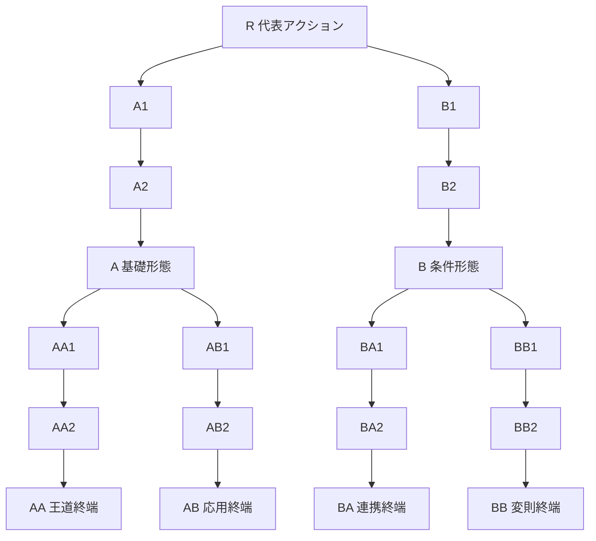

# 武器ツリー再設計 — 一つの主軸、積み重なるパッシブ、競合するリアクティブ

更新日: 2026-09-19
状態: **次の実装候補として採用する設計案。コード・保存形式・数値バランスは未変更。**
関連: PR #285 / PR #286、`11-weapon-catalog.md`

## 1. 発端

現行の技能構造には、次の問題がある。

- 味方アクティブの大半はAP1で、同じ一つの行動枠を奪い合う。
- 無条件アクティブを輪番にすると、二本目は一本目の代わりに出る。強い一本へ弱い二本目を足すと、
  技能点を払ったのに戦果が落ちる。
- 同じ技能をLv10まで上げる投資は出番を減らさないため、新しいアクティブを取る投資より安定して強い。
- 現行mainにはプレイヤー向けの節がactive 58 / reactive 55 / passive 29、合計142節ある。
  三つの巨大な森に分かれており、技能がどの戦い方へ属するかを一覧しにくい。

固定標本では、踏み込み斬りLv10に貫き突きLv1を足すだけで、10ラウンドの総ダメージが約72%まで
下がった。これは価格の誤差ではない。取得が不可逆なゲームで、横へ広げるほど弱くなる構造そのものが
問題である。

### 1.1 PR #285とPR #286から残すもの

PR #285の価格調整は集中投資の地点を動かすが、二本目が一本目の出番を奪う規則を変えない。
PR #286の「条件／主軸／予備」は事故を止めるが、主軸が使える間、予備を取る理由を作らない。

再設計へ残すのは次の三点である。

- 一人物が一拍に選ぶ主軸は一つでよい。
- 条件は、別の無条件アクティブを順番待ちさせるためでなく、主軸・対象・反応を変えるために使う。
- 対象決定は発動条件と別の軸であり、複数の行動へ横断して作用できる。

## 2. 採用する中心命題

> 構築の広がりは主軸の本数ではなく、一つの主軸へ積み重なるパッシブと、
> 同じ反応機会を取り合うリアクティブから作る。

この命題から、次を採用する。

1. 技能ツリーはアクティブ／リアクティブ／パッシブで分けず、戦槌・射出器・大盾などの武器別にする。
2. 各節には実行方式として**アクティブ／リアクティブ／パッシブ**の種別を表示する。
3. 一人物が選択するメインアクションは常に一つ。AP2なら同じ主軸を、盤面更新後に二度目も評価する。
4. 技能レベルを廃止する。深いアクティブ形態は同じ経路の旧形態を置き換える。
5. パッシブは該当したものをすべて適用する。早期returnせず、タイミングを消費しない。
6. リアクティブは優先列を上から検査し、最初に成立した一つだけ発動してreturnする。
7. 姿勢という独立種別と排他装着欄は作らない。姿勢らしい効果も、挙動に応じてパッシブかリアクティブにする。
8. 照準は一つだけ装着する技能にしない。複数の条件付き照準を優先列へ並べ、状況ごとのfallbackを作れる。
9. 一遠征で有効な武器は最大10種。新しい武器との入替は遠征開始前に確定する。

## 3. 三つの実行方式

三分類はツリーの置き場所ではなく、**同時に成立した技能をどう解決するか**を表す。

| 種別 | いつ読むか | 同時に成立したとき | 例 |
|---|---|---|---|
| アクティブ | 自分のAP起動時 | 選択中の主軸一つ | 槌打ち、治療、号令 |
| パッシブ | 常時、計算時、対象問い合わせ時 | 原則すべて適用 | 与ダメージ+20%、裂傷相手へ+1hit |
| リアクティブ | 明示されたeventの反応窓 | 優先列の最初の一つだけ | 被弾前に庇う、撃破時にAPを渡す |

### 3.1 アクティブ

- 一人物につきメインアクションを一つ選ぶ。
- 別武器のルートを取っても、現在のメインを勝手に切り替えない。
- 同じ経路の深い形態は親形態を置き換える。旧形態を別スロットへ残さない。
- 兄弟終端を両方取った場合は、遠征準備でどちらを主軸にするか選べる。

### 3.2 パッシブ

パッシブは条件付きでもよい。「常時発動」ではなく、**反応枠を消費せず計算へ参加する**ことが定義である。

- 取得したパッシブは原則すべて有効で、装着枠や排他枠を持たない。
- `与ダメージ+20%`と`裂傷中の敵へ+1hit`が両方成立すれば、両方を適用する。
- HP半分以下、前ラウンドに移動した、対象に状態がある、といった条件を持てる。
- 能力の上げ下げ、対象数変更、状態の増減、直接回復、資源上限変更も扱える。
- 通常パッシブの評価中にreturnしない。上の単純な効果が下の条件効果を奪ってはならない。

### 3.3 リアクティブ

リアクティブは明示されたeventに対する**選択肢の競合**である。

1. eventが反応窓を開く。
2. 反応する人物ごとに、取得済み技能から作ったリアクティブ優先列を上から検査する。
3. 条件、RP、回数制限を初めて満たした一つを解決する。
4. その人物の反応窓は閉じ、下の技能は検査しない。
5. 他の人物は固定の人物順で、自分の反応窓を同様に解決する。

したがって同じ人物の`被弾前に庇う`と`被弾前に反撃する`は両方起きない。どちらを上へ置くかが構築になる。
別のevent、たとえば`target_selected`と`damage_resolved`にはそれぞれ一度反応できる。

RPを払うかどうかは種別の定義ではない。RP0でも反応窓を一つ使うならリアクティブであり、RP1でも
常時有効な維持費として払うだけならパッシブになり得る。

### 3.4 姿勢を廃止する

「腰を落とす」「背水」「迎撃姿勢」を一律の排他グループにはしない。

- 移動していない間に受け+2: 条件付きパッシブ。別の防御パッシブと重なる。
- 攻撃を受ける直前に前へ出る: リアクティブ。ほかの被弾前反応と競合する。
- 主軸を変える構え: その武器のアクティブ形態。

同条件の効果を意図的に競合させたい場合はリアクティブにする。複数重なってよいならパッシブにする。
「姿勢だから排他」という例外規則は不要である。

## 4. 一回のAP起動をどう解決するか

1. 選択中のメインアクションを読む。
2. アクション固有の有効対象と、固定対象／全体対象かどうかを読む。
3. 単体攻撃なら照準問い合わせを解決し、最終候補を一体へ絞る。
4. 対象確定eventを出し、誘引などの強制対象変更を解決する。
5. 成立するパッシブをすべて集め、決められた計算順で合成する。
6. APと明示された追加費用を払い、アクションを解決する。
7. 発生したeventごとにリアクティブの反応窓を開く。

APを味方から受け取って三回目に動いても、装着欄の三番目が出ることはない。同じ主軸を再評価し、
HP、状態、対象、残り時間が変わった分だけ結果が変わる。

## 5. 対象決定

### 5.1 攻撃の既定は「最も近い敵」

単体攻撃に固有の対象規則も有効な照準パッシブもなければ、攻撃者から盤面上の距離が最小の敵を狙う。
同距離なら、画面に表示される固定のマス順で一体へ決める。乱数は使わない。

現在の前後2行×左右3列を使うなら、距離は`自分の後列深度 + 敵の後列深度 + 列番号の差の絶対値`とする。
前列の深度は0、後列は1、列番号は左0・中央1・右2である。定数を足しても順位は変わらないため省く。
盤面形状を変える場合も、表示された隣接関係から一意に計算できる距離だけを採用する。

この既定には二つの目的がある。

- 照準を取らない複数人は、それぞれ自分に近い敵を殴り、火力が散りやすい。
- `治療役優先`、`HP最低優先`、`準備中優先`を取ると、集中攻撃の形が目に見えて変わる。

距離の具体式は盤面実装時に決めるが、同じ盤面からは必ず同じ一体を返す。

### 5.2 照準パッシブは複数持てる

照準はパッシブの一種だが、対象問い合わせ専用の優先列を持つ。

1. 取得済みの照準パッシブを上から検査する。
2. 条件を満たし、かつ対象候補を一体以上返せる最初の規則を採用する。
3. そこで照準列からreturnし、その候補内を規則自身の優先順位と固定マス順で一体へ絞る。
4. 一つも成立しなければ、アクション固有の軟らかい照準、それもなければ最短距離を使う。

例として、`回復技能を持つ敵を優先`を`HP25%以下を優先`より上へ置けば、回復役がいる間は回復役を狙い、
いなくなれば瀕死を刈り、どちらもいなければ最も近い敵を狙う。

通常の`与ダメージ+5%`は照準問い合わせに登録されない。常時パッシブが照準列の先頭でreturnする事故は起きない。

### 5.3 アクション固有の対象規則

メインアクション自身が対象を決めてもよい。

- 固定: 自分、味方全体、敵一列など。照準パッシブを読まない。
- 強制: `印のある敵だけを狙う`など。条件を満たす対象がいなければ不発または別効果を明記する。
- 軟優先: `防壁のある敵を優先`など。照準パッシブが成立しなかったときだけ使う。

非攻撃アクションは必ず自分の既定対象を持つ。治療ならHP割合が最も低い味方、号令なら未行動の味方、
防壁なら防壁が最も少ない味方、というように一文で決める。非攻撃へ「最も近い敵」は適用しない。

### 5.4 誘引は確率ではなく回数

`守りを引く`は「狙われやすくなる」ではない。自分へ`誘引N`を付与する。

- 敵の単体攻撃対象が確定した後、誘引を持つ味方が有効対象なら、対象をその味方へ書き換えて1消費する。
- 複数人が誘引を持つ場合は、誘引の優先値、同値なら固定の人物順で一人へ決める。
- 全体攻撃、対象固定、誘引無効と明記された攻撃は書き換えない。
- 成否の揺れや「しやすさ」は存在しない。

## 6. 能力係数と届き方を分離する

次の全体規則は廃止候補とする。

- 技術係数だから後列へ届く。
- 腕力係数だから後列から使うと減衰する。
- 武器攻撃だから前列しか狙えず、技だから後列を狙える。

能力係数は量だけを決める。対象範囲、距離、前後列、使用位置、減衰は各アクションが別に宣言する。

- 腕力係数の重弩が後列から敵後列を撃ってよい。
- 技術係数の医療具が隣接した味方だけを治してもよい。
- 戦槌が後列から使えないなら、戦槌のアクション本文にそう書く。
- 位置条件が書かれていなければ、どの位置からでも同じ量で使える。

これにより、能力値、立ち位置、対象範囲を別々の設計軸として組み合わせられる。

## 7. 武器ツリーの共通形

一武器の標準形は19節とする。

`R + 2×3 + 4×3 = 19`である。枝の難しさを固定する。

| 経路 | 読み味 | 設計契約 |
|---|---|---|
| A | 基礎 | 無条件または一目で分かる強化。主軸の基本性能を上げる |
| A→AA | 王道 | 全武器で最も単純。署名武器では最も分かりやすく強い到達点にする |
| A→AB | 応用 | 範囲、回数、攻防配分など、扱いやすいsidegrade |
| B | 条件 | 状態、位置、対象、履歴、資源のどれかを使い始める |
| B→BA | 連携 | 別武器のパッシブや味方と接続する |
| B→BB | 変則 | その武器で最もトリッキー。規則を破る代わりに条件や代償を持つ |

A→AAに「被弾した量を保存し、次ラウンドに別対象へ渡す」のような処理を置かない。初めて木を見た人が
何も調べず進んでも、署名武器の王道枝で明確に強くなれるようにする。

## 8. 人物と武器

五人は、立ち絵と役柄に合う**署名武器**一つと、異なる遊びを持つ副武器一つを導入する。
解禁後のツリーは全員が利用できる。

| 導入人物 | 署名武器 | 副武器 | 画像・役柄との接続 |
|---|---|---|---|
| ゴウ | 戦槌 | 格闘具 | 立ち絵の大槌を王道にする。副武器は携行しやすく、技巧寄り |
| ツグミ | 射出器 | 医療具 | 手にした射出器と医療バッグを、攻撃と治療の二方向へ分ける |
| ナギ | 大盾 | 長槍 | 立ち絵の防護板と「気づくと前に立つ人」を王道にする |
| ヒバナ | 鉤縄 | 双刃 | ロープ、フック、走る・拾う・引っ張る役を王道にする |
| ゲンゾウ | 号旗 | 重弩 | 盤面を整える参謀を王道にし、本人が撃つ重兵器を副案にする |

戦槌と大剣を同時携行する案はやめる。ゴウの副武器は拳甲、手袋、脚技を含む格闘具とし、戦槌を捨てずに
別武器の規則へ入れる。大剣ツリーは今回の10武器から外す。

署名武器5種のA→AAは、その人物の初見ビルドである。強さを条件やコンボへ隠さず、威力、回数、対象数、
付与量を素直に増やす。副武器を選ぶことは、最初から少し変わった遊びを選ぶ意思表示になる。

## 9. ルート1SP

武器へ入るには人物ごとに1SPを払う。別武器のパッシブだけが欲しい場合も必要である。

これは偶然の前提税ではなく、次のための明示的な参入費である。

- 全武器から常にメイン候補を並べる操作負担を避ける。
- 全武器の浅いパッシブを無差別につまみ食いする構成へ小さい機会費用を置く。
- 署名武器と、別武器から借りた規則の差を残す。

現行候補の13〜15SPでは1SPの比率が大きい。総獲得SPと通常節の価格を大きい整数へ広げ、
ルート1SPを相対的に安くする案を優先して比較する。総SPと各価格はまだ決めない。

## 10. 時間切れと支援アクション

戦闘には時間切れがあるため、支援アクションへ弱い通常追撃を付ける必要はない。医療、盾、号令が一拍を
攻撃以外へ使うこと自体が、残り時間との交換になる。

- `治療`は治療だけを行ってよい。
- `守りを引く`は誘引と防壁だけを付けてよい。
- `号令`はAP移譲や強化だけを行ってよい。
- 攻撃も行う形態は、その形態固有の価値として明記する。

支援だけで敵を残し続けても、時間切れで敗北する。追加攻撃を全支援へ抱き合わせる方が、武器ごとの差を
消してしまう。

## 11. 現行engineの契約を設計上限にしない

この段階では、現在のeventや状態だけで実装できるかを技能案の上限にしない。

歓迎する例:

- 攻撃、受け、回復量、速度、最大HPなどを直接上げ下げするbuff/debuff。
- 直前の被ダメージと無関係に、能力係数や固定量でHPを大きく回復する。
- AP/RPの上限変更、次ラウンドからの借金、残り時間の消費や延長。
- 状態を複製、反転、全消費し、別の能力へ変える。
- 敵味方の位置を交換し、対象規則そのものを書き換える。
- 一戦に一度、倒れた味方を戻す、敵の次行動を味方の行動へ置き換える。

守る契約は、結果が決定論的で説明できること、無限実行を作らないこと、時間切れを含め必ず戦闘が終わる
ことだけである。面白い案を出した後に、新しい状態、event、query、計算段を実装課題として列挙する。

「命中しやすい」「狙われやすい」「発動しやすい」は使わない。確率がないため、対象優先、固定加算、
回数、閾値、確定状態のどれかで書く。

## 12. シナリオと武器manifest

- 第1シナリオではゴウとツグミの四武器を導入する。
- 第2シナリオでナギの二武器、第3でヒバナ、第4でゲンゾウを加え、最大10武器になる。
- 以後に新しい二武器を導入するときは、利用可能な武器を10種以内へ入れ替える。
- 利用可能な武器は遠征開始時から全戦分を開示する。SPを払った後で突然外さない。
- 署名武器がmanifestから外れる場合は、遠征開始時に別の主軸を選べる状態を保証する。

## 13. 一武器を設計するときの契約

1. 代表アクションと既定対象を一文で説明できる。
2. A→AAは無条件中心で、木の中で最も簡単に読める。
3. BBは木の中で最も変則的で、条件、代償、回数の少なくとも一つを持つ。
4. 主軸形態はR、A3、B3、AA3、AB3、BA3、BB3の7節に置く。
5. 残る12節はパッシブかリアクティブにし、その違いを「returnするか」で説明できる。
6. 照準パッシブは、条件と候補が空のときのfallbackを一文で説明できる。
7. 確率語を使わず、すべて同じ盤面から同じ結果を返す。
8. 能力係数から対象範囲や位置減衰を推論させず、必要ならアクション本文へ書く。
9. 署名武器のA→AAは人物の立ち絵と役割を最短で実現する。
10. ルート1SPを払った時点で、子を取らなくても試す価値がある。

## 14. 今回決めないこと

この文書と`11-weapon-catalog.md`は発想を広げる設計資料である。次は未検証・未決定とする。

- 係数、固定値、状態上限、持続時間の最終値。
- 総獲得SPと各節の価格。
- 新しい能力、event、target queryの実装方式。
- 既存技能ID、保存形式、旧データ移行。
- 10武器を同時表示する画面の具体レイアウト。

次の段階では、まず署名武器一つと副武器一つを紙上で組み、王道A→AAだけの構成、照準を借りる構成、
BBまで進む構成が、同じ敵に違う答えを出すかを比較する。
